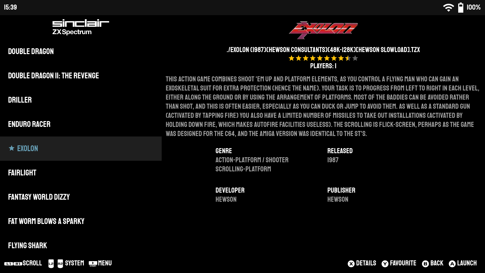
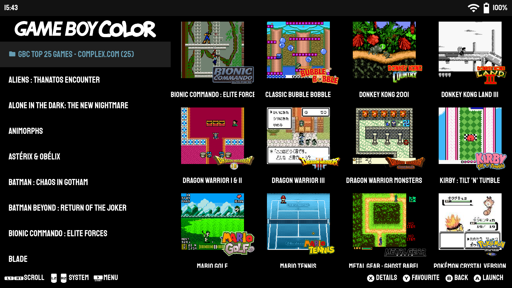

# Titanius Launcher

Titanius Launcher is a minimalistic, controller-first retro game launcher designed for those who want to enjoy a seamless gaming experience on their Android devices. 
Inspired by EmulationStation and AmberELEC, it allows users to easily integrate their pre-scraped ROMs libraries from Linux systems like AmberELEC and ArkOS. 

:video_game: Designed for Android devices with built-in controllers, such as Retroid 3/3+/Flip, Odin Lite/Pro, Anbernic RG552, Logitech G Cloud, ...
:video_game: Minimalistic, controller-first UI
:video_game: Reuse your existing pre-scraped ROMs library from Linux systems like AmberELEC and ArkOS
:video_game: Supports around 70 systems with Retroarch 64-bit and standlone emulators

## Download

Grab the latest apk from the [Releases](https://github.com/dsolonenko/titanius-launcher/releases) page and install it manually.

## How to use

Titanius Launcher is designed without a built-in game scraper, with the intention of reusing your existing, pre-scraped ROMs library on both Linux devices running AmberELEC, ArkOS, etc., and your Android device.

1. Organize your ROMs in a folder structure like this: [AmberELEC](https://amberelec.org/systems/)
2. Use [Skraper](https://www.skraper.net/) to scrape your ROMs and generate `gamelist.xml` files, along with images and/or videos
3. Transfer your ROMs to your Android device's Internal Storage or SD card in one of these locations: `Internal Storage/Roms`, `SD Card/. (Root)`, `SD Card/Roms`
4. Set up Titanius Launcher to include the ROMs folder
5. Have fun!

## Standalone Emulators

Due to the Storage Access Framework (SAF) restrictions, you might have to grant Titanius Launcher permission to share ROM files with standalone emulators. 
To accomplish this, navigate to Settings -> ROMs Folders -> Add Shared Folder and add the relevant folders. Ensure that these folders correspond to the ones used in your standalone emulators. 
For instance, if you're using the standalone Drastic for DS, the shared folder in Titanius Launcher and the Drastic folder should both be set to `[ROMs Folder Location]/Roms/nds`.

**Note**: Unfortunately, this is a necessary step that requires using a touchscreen.

## Notes

1. This is a work in progress. Expect some bugs and crashes.
2. No built-in game scraper. It relies on EmulationStation's `gamelist.xml` files.
3. Offers minimal required functionality. If you're seeking something more robust, [Daijishō](https://github.com/magneticchen/Daijishou) is highly recommended.
4. Currently configured with [Retroarch 64-bit](https://buildbot.libretro.com/stable/1.15.0/android/RetroArch_aarch64.apk) and a few standalone emulators. For a list of supported systems and emulators, see this [JSON config file](assets/metadata.json).
5. Can function as a home launcher or a standalone frontend.
6. Relies on the controller, touch interface can be hit and miss

## Screenshots

Landing page with a scrolling list of systems:

Games page:

Game details:

Folders support:

Collections:

Android apps:

Settings:

## Attributions

- [Staatliches Font designed by Brian LaRossa, Erica Carras](https://fonts.google.com/specimen/Staatliches/about)
- [PromptFont by Shinmera](https://github.com/Shinmera/promptfont/)
- [Console logos created by Dan Patrick](https://archive.org/details/console-logos-professionally-redrawn-plus-official-versions)
- [App icon created by Irfansusanto20 - Flaticon](https://www.flaticon.com/free-icons/game-console)
- Initial emulators configs imported from Daijishō and Pegasus Frontend