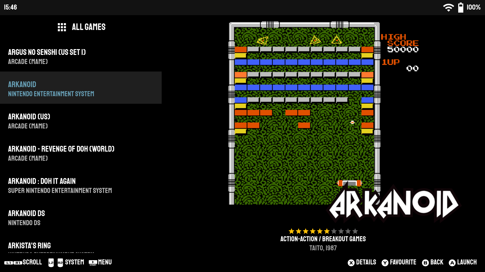

# Titanius Launcher

Titanius Launcher is a minimalistic, controller-first retro game launcher designed for those who want to enjoy a seamless gaming experience on their Android devices. 
Inspired by EmulationStation and AmberELEC, it allows users to easily integrate their pre-scraped ROMs libraries from Linux systems like AmberELEC and ArkOS. 

- Designed for Android devices with built-in controllers, such as Retroid 3/3+/Flip, Odin Lite/Pro, Anbernic RG552, Logitech G Cloud, etc.
- Minimalistic, controller-first UI
- Reuse your existing pre-scraped ROMs library from Linux systems like AmberELEC and ArkOS
- Supports over 70 systems with Retroarch 64-bit and standlone emulators

## Download

Grab the latest apk from the [Releases](https://github.com/dsolonenko/titanius-launcher/releases) page and install it manually.

## How to use

Titanius Launcher is designed without a built-in game scraper, with the intention of reusing your existing, pre-scraped ROMs library on both Linux devices running AmberELEC, ArkOS, etc., and your Android device.

1. Organize your ROMs in a folder structure like this: [AmberELEC](https://amberelec.org/systems/)
2. Use [Skraper](https://www.skraper.net/) to scrape your ROMs and generate `gamelist.xml` files, along with images and/or videos
3. Transfer your ROMs to your Android device's Internal Storage or SD card in one of these locations: `Internal Storage/Roms`, `SD Card root`, `SD Card/Roms`
4. Set up Titanius Launcher to include the ROMs folder
5. Have fun!

## Notes

1. This is a work in progress. Expect some bugs and crashes.
2. No built-in game scraper. It relies on EmulationStation's `gamelist.xml` files.
3. Offers minimal required functionality. If you're seeking something more robust, [Daijishō](https://github.com/magneticchen/Daijishou) is highly recommended.
4. Currently configured with [Retroarch 64-bit](https://buildbot.libretro.com/stable/1.15.0/android/RetroArch_aarch64.apk) and a few standalone emulators. For a list of supported systems and emulators, see this [JSON config file](assets/metadata.json).
5. Can function as a home launcher or a standalone frontend.
6. Relies on the controller, touch interface can be hit and miss

## Screenshots

Landing page with a scrolling list of systems:

Games page:

Folders support:

Android apps:

Some settings:

## Attributions

- [Staatliches Font designed by Brian LaRossa, Erica Carras](https://fonts.google.com/specimen/Staatliches/about)
- [PromptFont by Shinmera](https://github.com/Shinmera/promptfont/)
- [Console logos created by Dan Patrick](https://archive.org/details/console-logos-professionally-redrawn-plus-official-versions)
- [App icon created by Irfansusanto20 - Flaticon](https://www.flaticon.com/free-icons/game-console)
- Initial emulators configs imported from Daijishō and Pegasus Frontend